# 💰 Sistema para Controle Financeiro

> Projeto acadêmico para a disciplina de Engenharia de Software I.

### 📌 Escopo do Sistema

O projeto tem como objetivo desenvolver uma aplicação web voltada ao controle financeiro pessoal, permitindo que usuários acompanhem suas receitas e despesas de maneira prática, intuitiva e organizada. O sistema contará com autenticação de usuários, garantindo que cada pessoa tenha acesso apenas aos seus próprios dados financeiros. Entre as principais funcionalidades estão o cadastro e gerenciamento de transações financeiras, categorização de despesas e receitas, visualização de saldo total e análise de informações por meio de dashboards e gráficos simples. A aplicação também buscará facilitar o acompanhamento financeiro diário através de uma interface limpa e acessível.

---

### 👥 Equipe de Desenvolvimento

| Integrante | Papel |
|---|---|
| **Jonas** | Backend Developer |
| **Júlia** | Frontend Developer |
| **André** | Frontend Developer |
| **João Pedro** | Backend Developer |

---

### 💻 Tecnologias Utilizadas

| Categoria | Tecnologias |
|---|---|
| **Backend** |   |
| **Frontend** |    |
| **Banco de Dados** |  |
| **Versionamento** |   |

---

### Backlog do Produto

| ID   | História de Usuário                                                                                                                           |
|------|-----------------------------------------------------------------------------------------------------------------------------------------------|
| US01 | Como usuário, quero me cadastrar no sistema informando nome, identificador e senha para acessar minha conta.                                  |
| US02 | Como usuário, quero realizar login utilizando identificador e senha para acessar minhas informações financeiras.                              |
| US03 | Como usuário, quero cadastrar transações financeiras contendo nome, data, valor, categoria e ganhos ou gastos para organizar minhas finanças. |
| US04 | Como usuário, quero adicionar categorias personalizadas durante o cadastro de transações para adaptar o sistema às minhas necessidades.       |
| US05 | Como usuário, quero visualizar minhas transações em formato de lista para acompanhar meus registros financeiros.                              |
| US06 | Como usuário, quero visualizar um resumo financeiro em dashboard para acompanhar meu saldo e estatísticas.                                    |
| US07 | Como usuário, quero editar transações já cadastradas para corrigir informações incorretas.                                                    |
| US08 | Como usuário, quero excluir transações cadastradas para remover registros desnecessários.                                                     |
| US09 | Como usuário, quero visualizar a descrição das minhas transações.                                                                             |
| US10 | Como usuário, quero gerenciar os dados do meu perfil para manter minhas informações pessoais e credenciais sempre atualizadas.                |
| US11 | Como usuário, quero alternar entre os temas claro e escuro para maior conforto visual.                                                        |
| US12 | Como usuário, quero realizar logout do sistema para encerrar minha sessão com segurança.                                                      |

---

### Backlog da Sprint

| ID | História da Sprint | Tipo CRUD | Critério de Aceitação |
|---|---|---|---|
| SB01 | Como usuário, quero cadastrar uma nova conta no sistema para acessar a aplicação. | Create | Cadastro salvo corretamente no banco e validação de senha funcionando. |
| SB02 | Como usuário, quero adicionar uma nova transação financeira. | Create | Transação cadastrada com nome, data, valor, categoria e tipo. |
| SB03 | Como usuário, quero editar informações de uma transação existente. | Update | Pop-up abre preenchido e salva alterações corretamente. |
| SB04 | Como usuário, quero excluir uma transação cadastrada. | Delete | Sistema solicita confirmação antes da exclusão e remove o registro do banco. |
| SB05 | Como usuário, quero criar categorias personalizadas durante o cadastro de transações. | Create | Nova categoria aparece disponível após cadastro. |
| SB06 | Como usuário, quero visualizar minhas transações financeiras em lista. | Read | Sistema exibe todas as transações cadastradas do usuário. |
| SB07 | Como usuário, quero visualizar um resumo financeiro em dashboard para acompanhar meu saldo e estatísticas. | Read | Sistema exibe corretamente saldo total, receitas, despesas e estatísticas das transações cadastradas. |

--- 

### Diagramas

A modelagem comportamental e estrutural do sistema foi mapeada através dos diagramas abaixo. Clique nas setas para visualizar.
* **[Diagrama de Casos de Uso](docs/diagramas/caso_de_uso.png):** Visão geral das 11 interações possíveis do ator com o sistema.
  

    
<b>📋 Casos de Uso</b>

     
    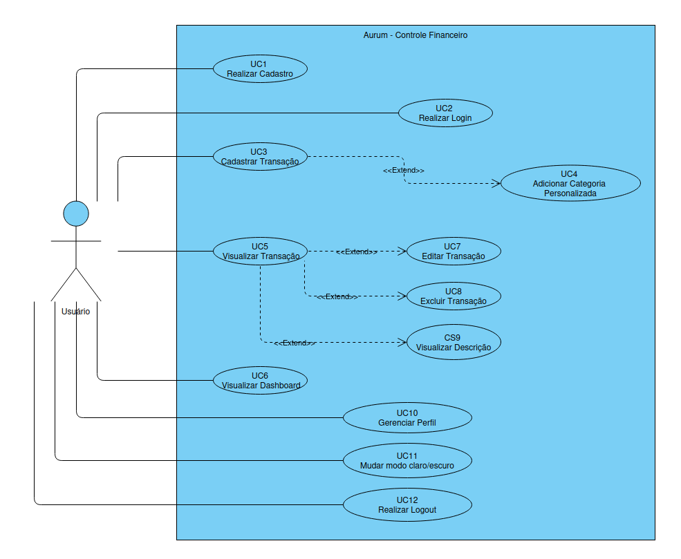
  
 

* **[Diagramas de Atividades](docs/diagramas/atividades/):** Mapeamento do fluxo de processos passo a passo de cada História de Usuário.
  

    
<b>📋 US01 </b>

     
    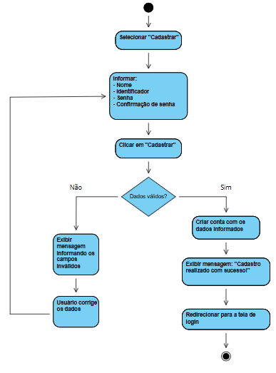
  

  

    
<b>📋 US02 </b>

     
    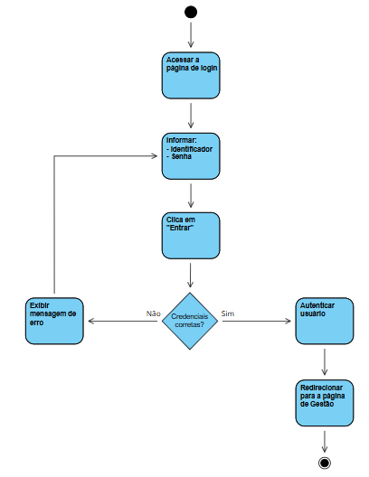
  

  

    
<b>📋 US03 </b>

     
    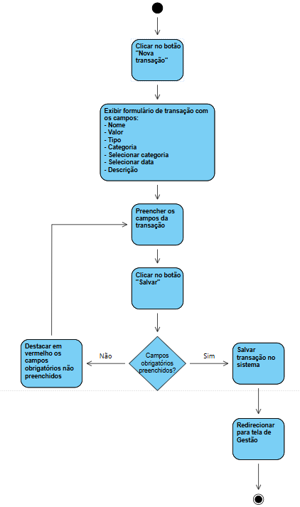
  

  

    
<b>📋 US04 </b>

     
    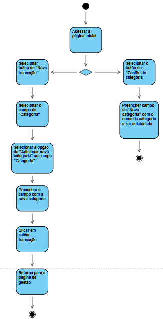
  

  

    
<b>📋 US05 </b>

     
    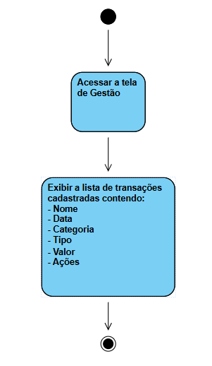
  

  

    
<b>📋 US06 </b>

     
    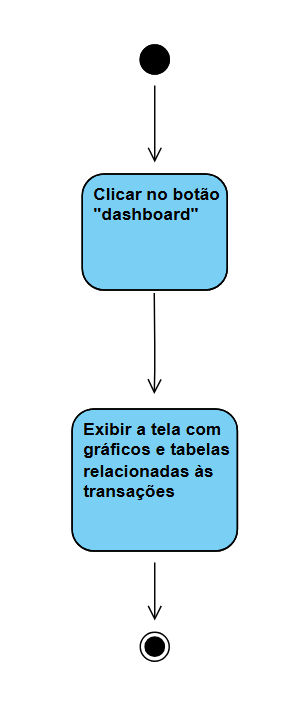
  

  

    
<b>📋 US07 </b>

     
    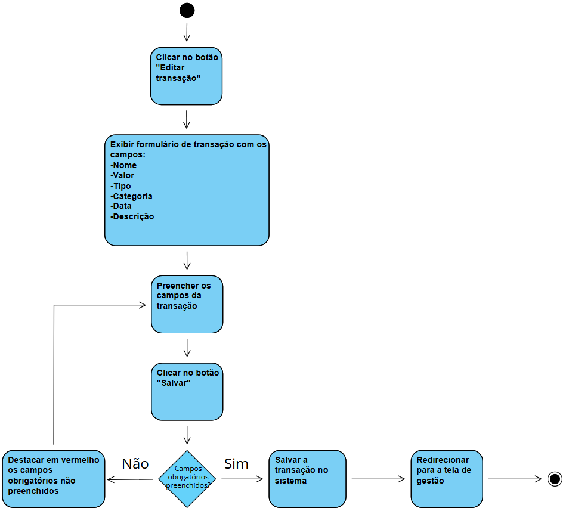
  

  

    
<b>📋 US08 </b>

     
    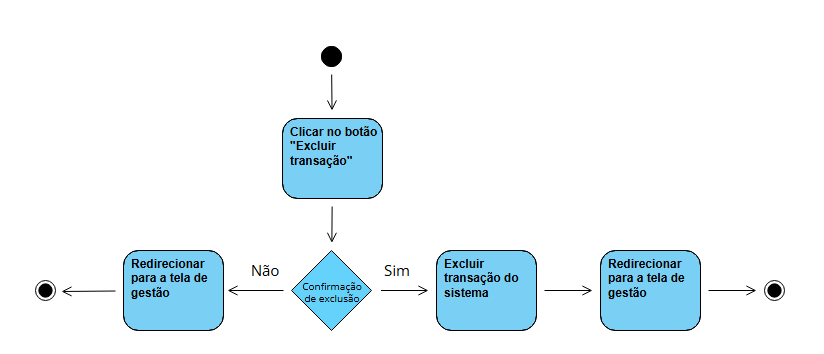
  

  

    
<b>📋 US09 </b>

     
    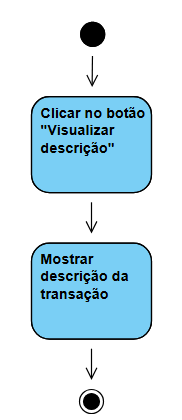
  

  

    
<b>📋 US10 </b>

     
    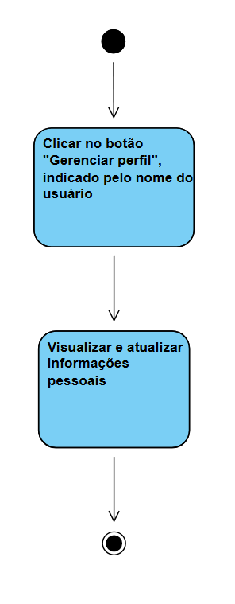
  

  

    
<b>📋 US11 </b>

     
    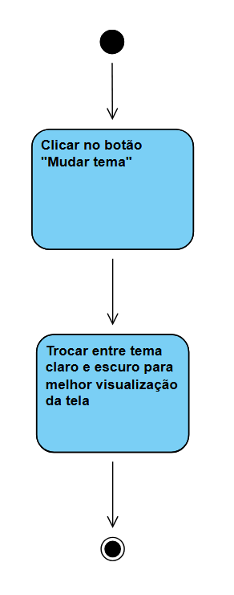
  

  

    
<b>📋 US12 </b>

     
    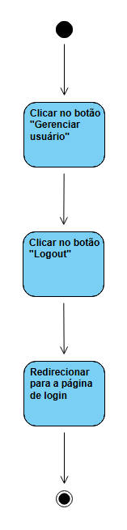
  

* **[Diagrama de Classes](docs/diagramas/classes.png):** Estrutura orientada a objetos das entidades do domínio.
  

    
<b>📋 Classes</b>

     
    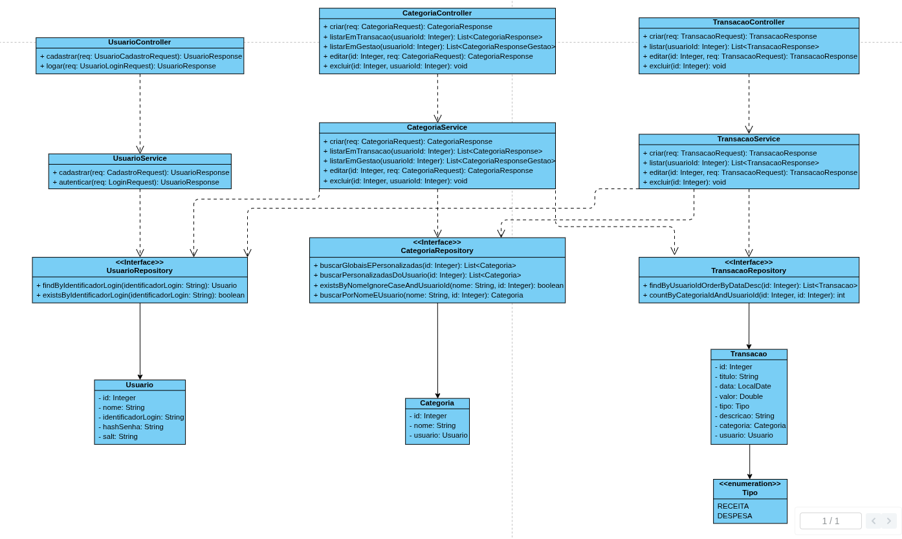
  

---

### Protótipos

As imagens foram retiradas do próprio projeto. Não contém todas as imagens em ambos os temas para evitar redundância no README.

  
<b>📋 Login (tema escuro) </b>

   
  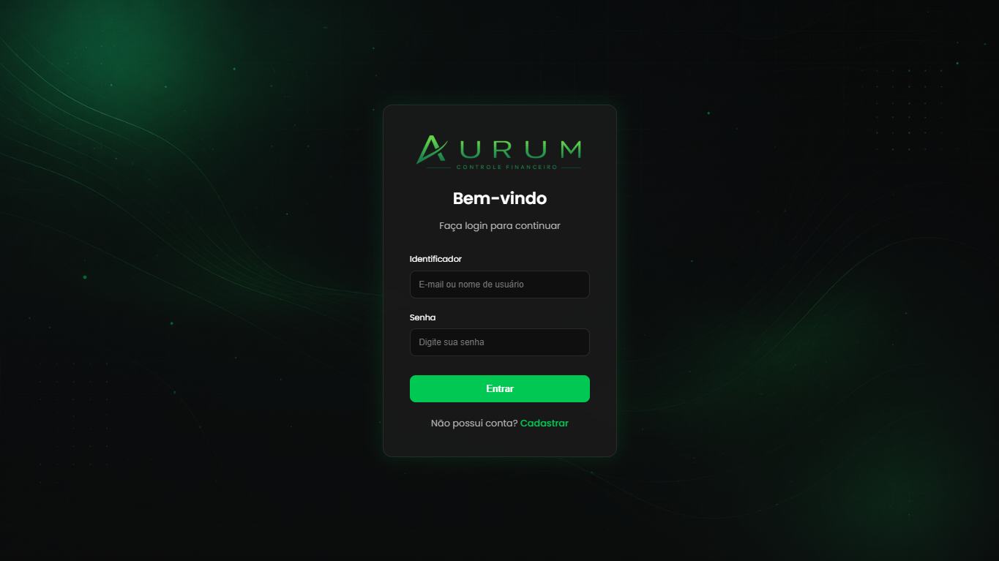

  
<b>📋 Cadastro (tema escuro) </b>

   
  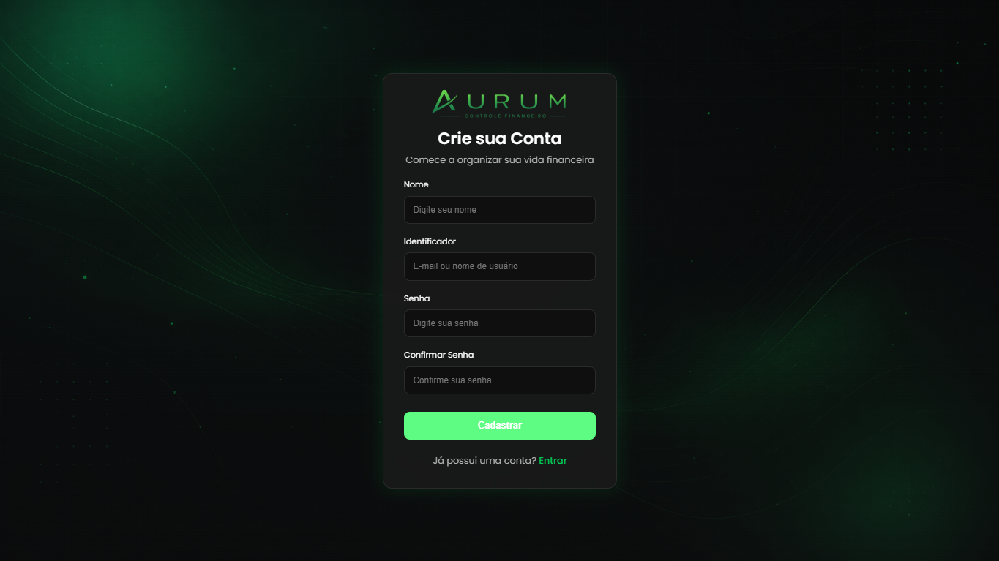

  
<b>📋 Gestão (tema escuro) </b>

   
  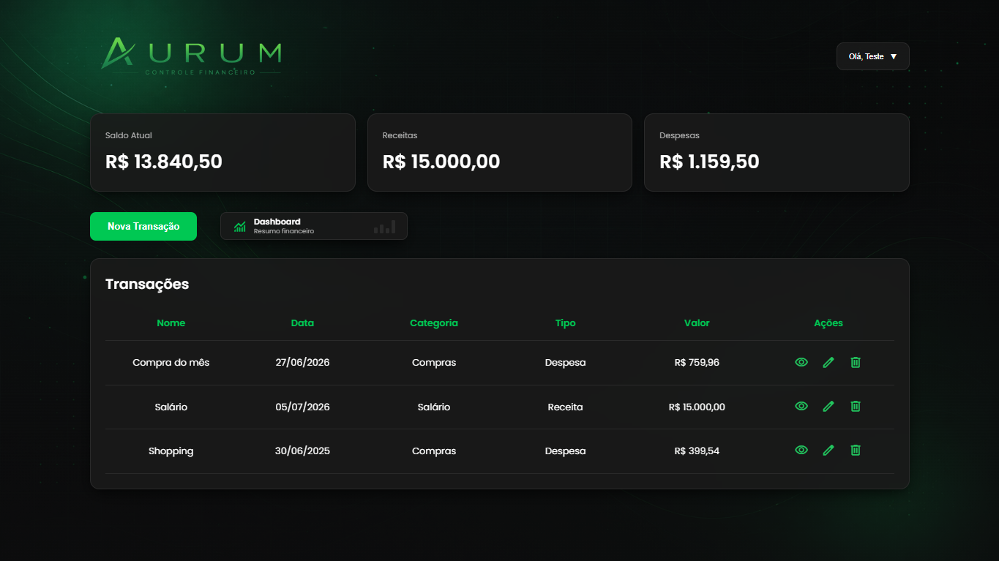

  
<b>📋 Nova Transação (tema escuro) </b>

   
  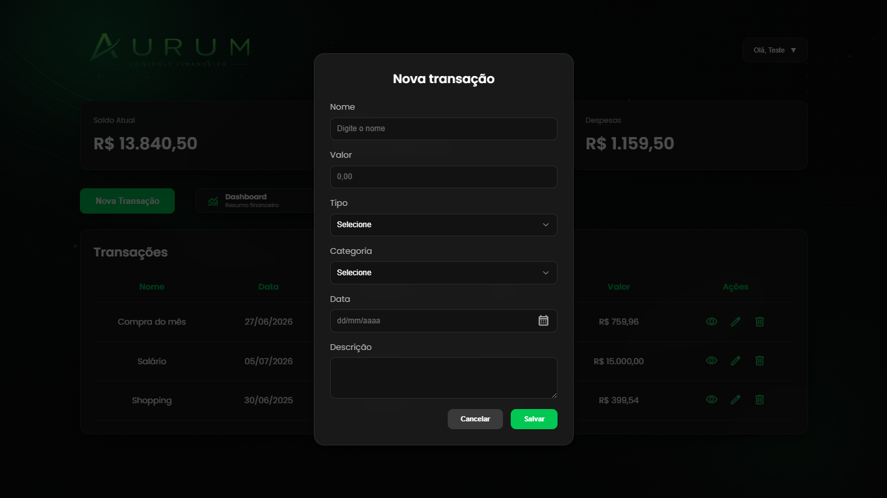

  
<b>📋 Login (tema claro) </b>

   
  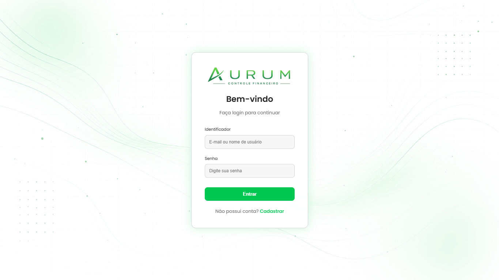

  
<b>📋 Gestão (tema claro) </b>

   
  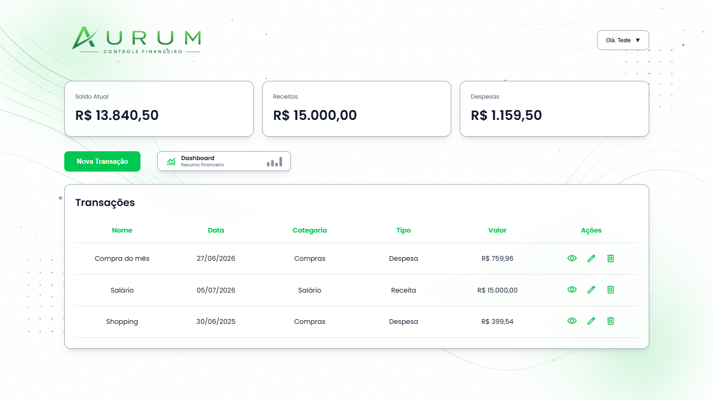

---

### Documentação

Para maior detalhes do banco de dados, veja este [diretório](docs/bd/).

