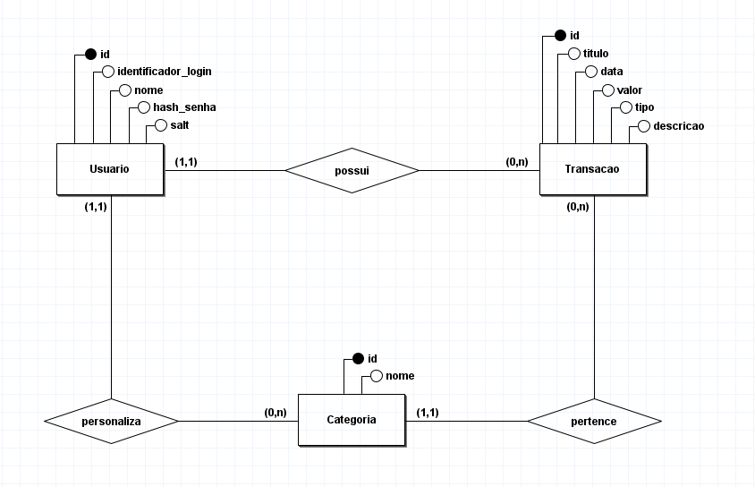

# Banco de Dados

Foi utilizado, neste projeto, o banco de dados relacional **SQLite**.

O diagrama **Entidade-Relacionamento** criado para esquematização das tabelas apresenta-se abaixo:  
  
Para abri-lo no software brModelo e realizar modificações, baixe o [arquivo](diagrama_er.brM3).

---

## Modelo Relacional

A partir do diagrama, foi mapeado o seguinte modelo relacional:

**USUARIO**(<u>id</u>, identificador_login, nome, hash_senha, salt)  

**CATEGORIA**(<u>id</u>, nome, usuario_id)  
`usuario_id` referencia **USUARIO**(id)

**TRANSACAO**(<u>id</u>, titulo, data, valor, tipo, descricao, categoria_id, usuario_id)  
`categoria_id` referencia **CATEGORIA**(id)  
`usuario_id` referencia **USUARIO**(id)

---

As **_Migrations_** implementadas neste sistema estão disponíveis [neste diretório](../../src/main/resources/db/migration).
